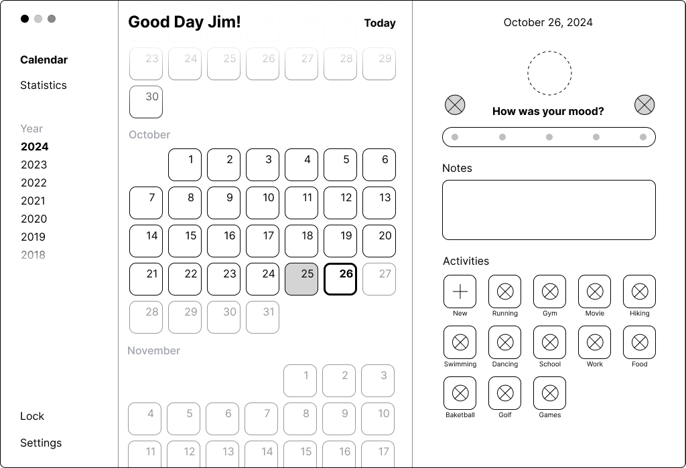
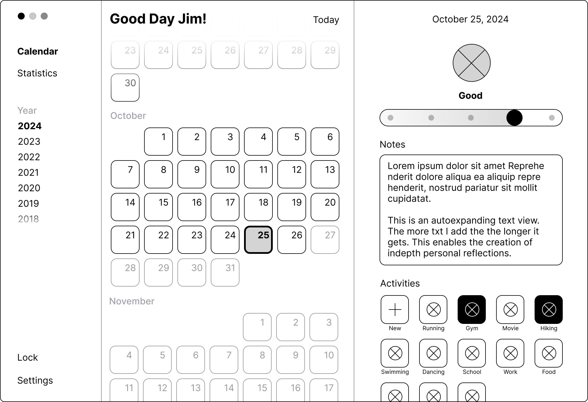
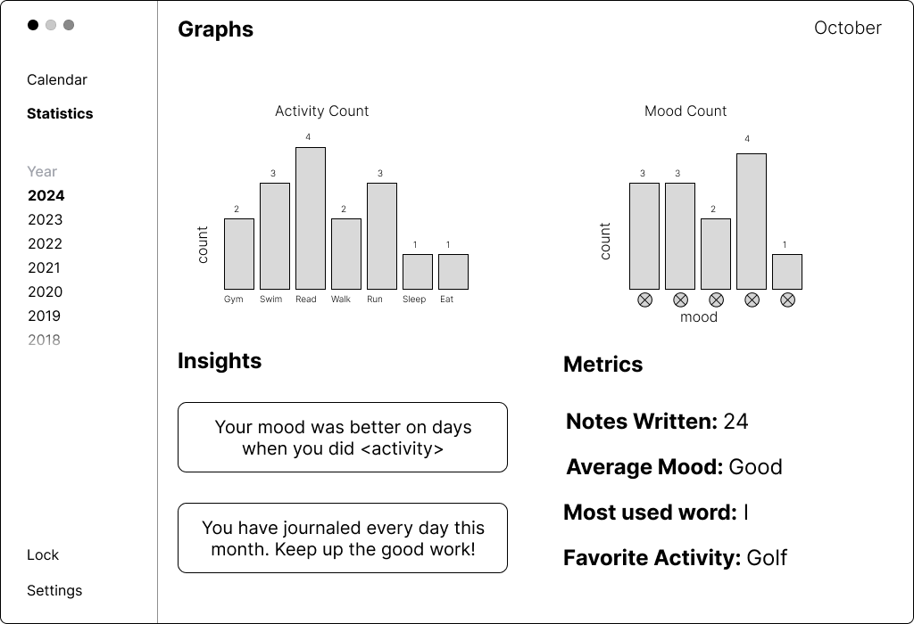
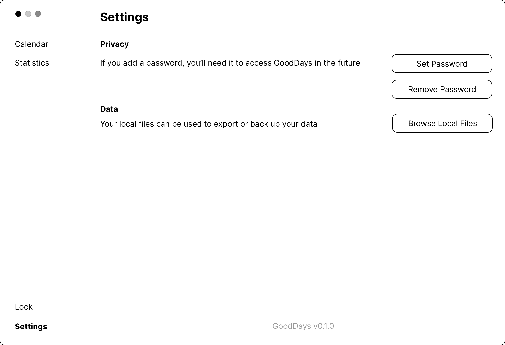
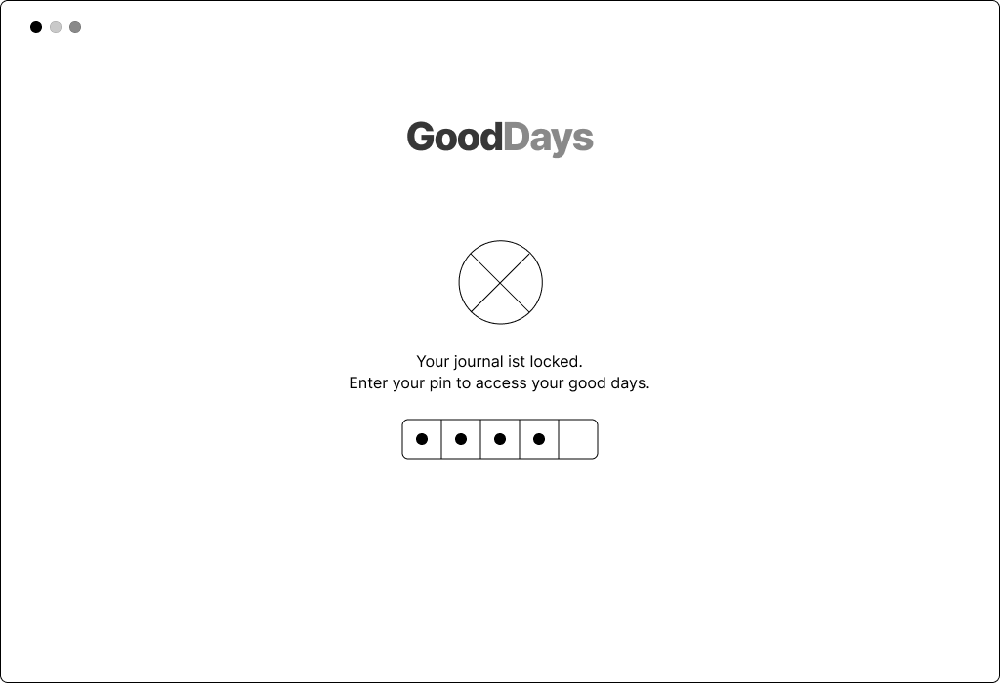

# Wireframes

This page provides an overview of our initial wireframes for GoodDays.

You can also explore these as an [interactive prototype](https://www.figma.com/proto/aYQQm6fKLdjinvOLKM1ipi/Good-Days-Wireframe?node-id=89-2028&t=V4mFuoQVz4xvpDUi-1).

## Calender Screen

*Creating a new day log entry.*

*Editing an existing entry.*

*Create/edit/delete an activity.*

The ⨂ symbols are placeholders for mood and activity emojis or plus/edit/delete icons.

## Statistics Screen

*See statistics for a given month.*

## Settings Screen

*Edit application settings.*

*Settings dialogs.*

*Unlock screen.*

